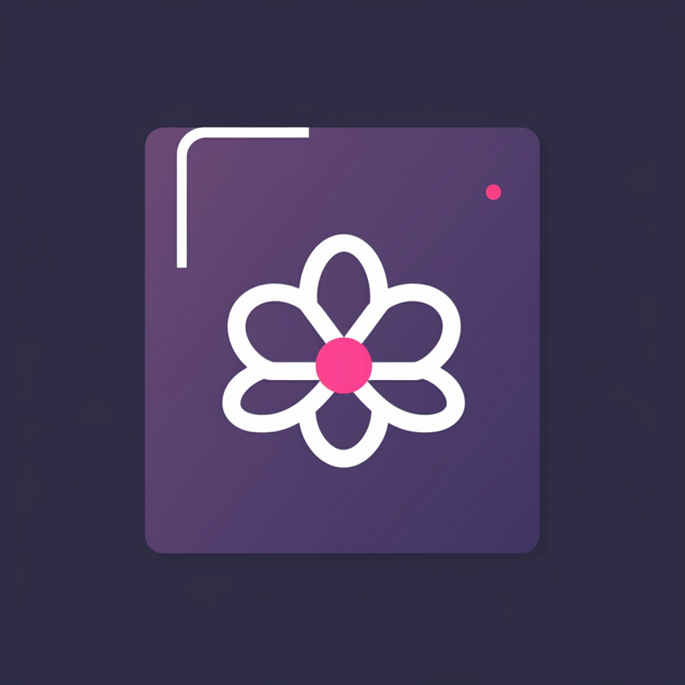

# Newtron Components



Newtron Components is a collection of reusable React components designed to simplify the development of user interfaces wrapping the MUI components. This library is accompanied by Storybook, providing an interactive way to explore and experiment with the components.

## Installation

To get started with Newtron Components, you can install it via npm or yarn:

```bash
npm install @lozadaa/newtron-components
# or
yarn add @lozadaa/newtron-components
```

### Available Components

- **Button**: A versatile button component.
- **Input**: A customizable input field.
- (List other components here...)

For detailed usage instructions and examples, please visit the Storybook documentation.

## Documentation

Each component is documented in our Storybook, which provides comprehensive examples, usage guidelines, and customization options. To explore the documentation, visit our Storybook.

## Customization

Our components are designed to be highly customizable to suit your project's requirements. You can adjust styles, props, and behavior as needed. Refer to the individual component's documentation for customization options.

## Contributing

We welcome contributions from the community. If you want to contribute new components, enhance existing ones, or improve documentation, please review our Contribution Guidelines.

## License

Newtron Components is open-source software licensed under the MIT License. See the LICENSE file for details.

## Support

If you encounter issues, have questions, or want to request features, please feel free to open an issue on our GitHub repository.
